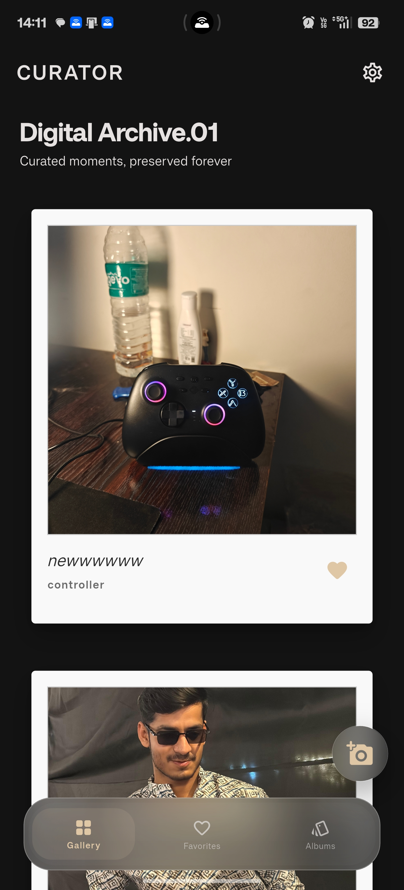
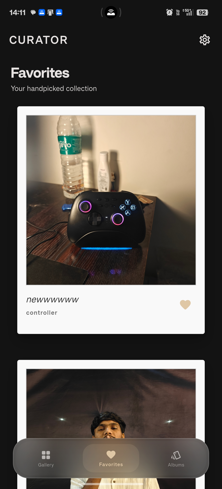
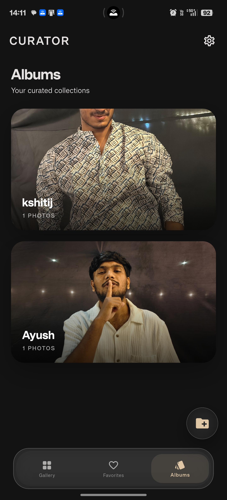
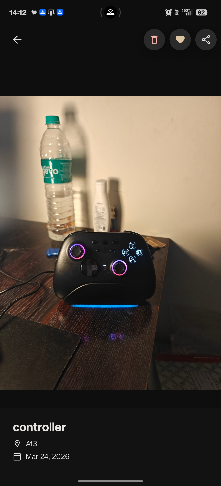

# Curator Gallery

Professional photo management and curation application built with Flutter, focusing on modern aesthetics, user-centric navigation, and persistent customization.

## Overview

Curator is a high-fidelity gallery application that bridges the gap between classic artistry and modern mobile design. Utilizing a sophisticated "frosted glass" (Glassmorphism) design language and Material 3 principles, the application provides a premium environment for organizing and viewing digital media.

## Visual Interface

The application features a minimalist layout designed to keep the focus on the content. Below are the key screen representations:

### Screen Layouts

| Gallery View | Favorites | Albums |
| :---: | :---: | :---: |
|  |  |  |

### Interactive Elements

| Detailed View |
| :---: |
|  |


---

## Core Features

- **Advanced UI Architecture**: Implements a deep Glassmorphism layer with high-sigma blurring, inner-glow shadows, and responsive layouts.
- **Masonry Grid System**: Staggered grid rendering for dynamic photo presentation and optimal space utilization.
- **Persistent Personalization**: Integrated theme engine using local storage to maintain user preferences across device sessions (Accent colors, Light/Dark modes, Typography).
- **Haptic & Visual Feedback**: Integrated micro-animations including heart-pop interactions on double-tap and smooth card-slide transitions.
- **Native Media Integration**: Direct connection to device storage for authentic image curation and album management.

## Technical Specifications

### Framework & Language
- **Flutter SDK**: 3.x+
- **Dart Language**: Modern null-safe syntax

### Key Libraries
- **State Management**: Provider
- **Local Persistence**: Shared Preferences
- **Backend Architecture**: Firebase Core
- **Typography**: Google Fonts (Inter, Roboto, Outfit)
- **UI Components**: Staggered Grid, Cached Network Image, Floating Action Buttons

---

## Installation and Setup

### Prerequisites
- Flutter SDK (Stable)
- Android SDK / iOS Development Environment
- Hardware device or Emulator

### Setup Instructions

1. **Clone the Repository**
   ```bash
   git clone https://github.com/your-username/polaroid_gallery_app.git
   ```

2. **Install Dependencies**
   ```bash
   flutter pub get
   ```

3. **Firebase Configuration**
   Ensure `google-services.json` (Android) and `GoogleService-Info.plist` (iOS) are placed in their respective platform directories.

4. **Build and Run**
   ```bash
   flutter run
   ```

## Build for Release
To generate a production-ready APK for Android:
```bash
flutter build apk --release
```

## License
This project is licensed under the MIT License. See the [LICENSE](LICENSE) file for the full text.

---
Developed by Ayush Rajput
